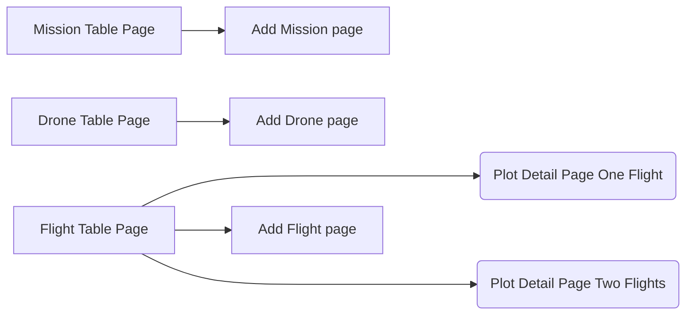

[](https://codecov.io/gl/searchwing:development:groundstation/flight-data-service)


# Flight Data App - Log Viewer

The go-to place for log files.

Log Viewer is a progressive web application that aims to enable our team to keep flight documentation in a centralized place and organize files in a systematic manner. It allows drone developers/operators to maintain the drone fleet status up to date, create missions and flights and attach data to them. The MAVLink log files attached to a flight are post-processed and messages are saved into a PostgreSQL database with TimescaleDB. Besides, some relevant attributes for a flight, such as battery consumption, flight distance, etc. are calculated from the MAVLink files and displayed in a table view.

## Architecture

Log Viewer is composed by 5 applications alltogether:

- Client side:
  - Next.JS based frontend, with what the users interact

- Server side:
  - API, which feeds and digests the data
  - Consumer/Worker to process flights asynchronously
  - Redis as a broker for the async worker
  - PostgreSQL to keep our precious data

### Frontend

#### Tech Stack

- React.js
- Next.js 12
- Typescript & openapi-typescript-codegen for generating the types from the BE
- React-query for data fetching and caching
- Axios client for calling the Backend Rest API
- React-Table v7 for showcasing
- Recharts for plotting the data
- React Hook Form for form management
- Dexie.js IndexedDB for creating a database on the frontend to persist data

#### Interface structure



#### Code Structure

The frontend code lies under `./client`, and it is composed of:

- /pages contains all the next.js pages which offers file-system based routing
- /views contains encompassing component views matching the views mentioned in **## Frontend - Interface structure**
- /api for now contains all the functions for interacting with the rest api backend
- /modules contain smaller components like Button or bigger component systems like PlotInterfaceComponents
- /types contain types for typescript generated with openapi-typescript-codegen


### Backend

#### Tech stack

- Python 3.6+
- FastAPI, for the REST endpoints
- Celery, for the sidecar worker app
- Pydantic for the internal entities
- SQLAlchemy as ORM
- GeoAlchemy to handle geospatial coordinates
- Redis as broker
- PostgreSQL as database

#### Database schema

The database is composed by the following entities:


#### Code structure

The server code lies under `./server` and is organized following [DDD](https://en.wikipedia.org/wiki/Domain-driven_design) principles:

- `/domain` is where all internal entities (classes) are located - `Flight`, `Drone`, `Mission`
- `/infrastracture` contains all the code that handles communication with external applications, such as the database. This layer contains repositories (to handle transactions) and database models.
- `/application` contains the logic of the app, i.e., the services that are in charge of processing requests/events.
- `/presentation` contains what is exposed to the outside world:
    1. The RestAPI: controllers, dependencies and serializers.
    2. The Celery worker: tasks, etc...

## Development

To run the app, we recommend using Docker as allows you to spin up all services within a single command, however we provide instructions for local development as well.

### Run with docker - aka the easy way

#### Prerequesites

- Docker + Docker Compose

#### Steps

This will build all images and create persistent directories to store local data. For the backend, this will also run a script to fill up with mock data (`./server/scripts/fill_up_db.py`)

```bash
docker compose up --build
```

If you want to do some changes in the app, simply re-build the image by running the same command.

### Run locally - aka the hard way

#### Prerequisites

Frontend:
    - Node18

Backend:
    - PostgreSQL server running (either locally or somewhere else) - you can also run a db instance with `docker compose up -d db`
    - Redis server - you can use the one provided in the compose file with `docker compose up -d redis`
    - Python 3.6+
    - Optional: Flower to monitor the worker tasks. You can use the one in the compose file: `docker compose up -d flower`

#### Steps

Frontend:

- go to folder ./client/nextapp
- run `npm install`
- run `npm run dev`
- go to localhost:3000

API:

- Optional: create a python venv - using your favourite provider aka pyenv/venv/conda
- Install dependencies with `make install-back-deps`
- Make sure that a db and redis instance are running and you've set the right env variables (see docker-compose for an example)
- Run with `python server/api.py` (use `-h` to see the available arguments)

Worker:

- Start the app with `python server/worker.py`

If you want to see the worker dashboard (for tasks monitoring), run `docker compose up -d flower`

#### Run tests - Backend

Make sure you have an instance of postgres running to run the integration tests, and that the env variables `POSTGRES_TEST_SERVER` and `POSTGRES_TEST_PORT` are correctly set.

```bash
make install-back-test-deps
make test-unit-server
```

## Deployment

The app is hosted in the cloud inside a VM powered by [CapRover](https://caprover.com/). A deployment is triggered to staging and production environments after merge to `dev` and `main`, respectively.

To manually trigger a re-deployment, simply run the CI pipeline `deploy-dev` and `deploy`.

### Links

- Frontend:
  - [Staging](http://staging.flight-data.searchwing.org/)
  - [Production](http://staging.flight-data.searchwing.org/)
- API:
  - [Staging](http://api.staging.flight-data.searchwing.org/)
  - [Production](http://api.flight-data.searchwing.org/)
- Tasks monitoring:
  - [Staging](http://tasks.staging.flight-data.searchwing.org/)
  - [Production](http://tasks.flight-data.searchwing.org/)

The database in `staging` runs as a docker container in CapRover, which might be unstable. For production environment, we use a separate server (still TBD).

## Maintainers

This app is developed/maintained by [maimai94](https://gitlab.com/maimai94) and [rmargar](https://gitlab.com/rmargar), in case of further questions feel free to reach out to them.
