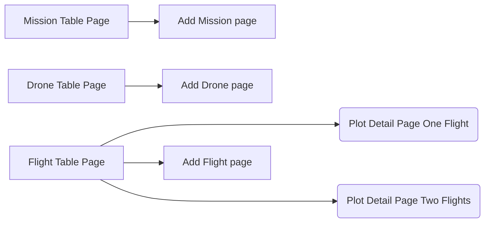

# Flight Data Service

The go-to place for log files

# Developer Readme

## Frontend - Interface structure

## Frontend - Tech Stack

- React.js
- Next.js 12
- Typescript & openapi-typescript-codegen for generating the types from the BE
- React-query for data fetching and caching
- Axios client for calling the Backend Rest API
- React-Table v7 for showcasing
- Recharts for plotting the data
- React Hook Form for form management
- Dexie.js IndexedDB for creating a database on the frontend to persist data

## Frontend - Main Folders

- /pages contains all the next.js pages which offers file-system based routing
- /views contains encompassing component views matching the views mentioned in **## Frontend - Interface structure**
- /api for now contains all the functions for interacting with the rest api backend
- /modules contain smaller components like Button or bigger component systems like PlotInterfaceComponents
- /types contain types for typescript generated with openapi-typescript-codegen

## Frontend - How to run the Frontend Server server locally

### Prerequisites:

- You need to have Node 18 installed
- You need to have docker installed
- The BE has be running with docker locally

### Start local server

- go to folder ./client/nextapp
- run `npm install`
- run `npm run dev`
- go to localhost:3000

## Backend-Readme is coming soon
